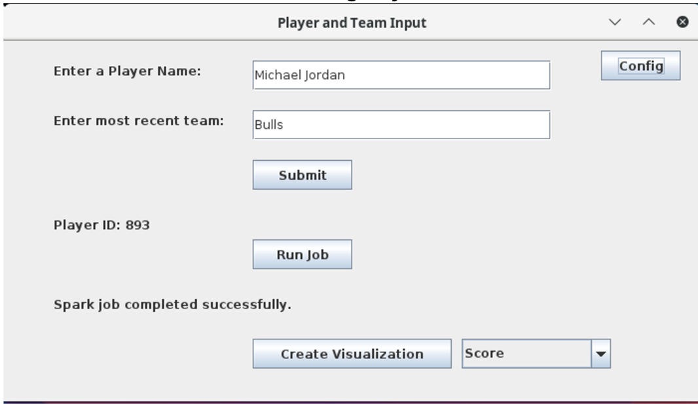
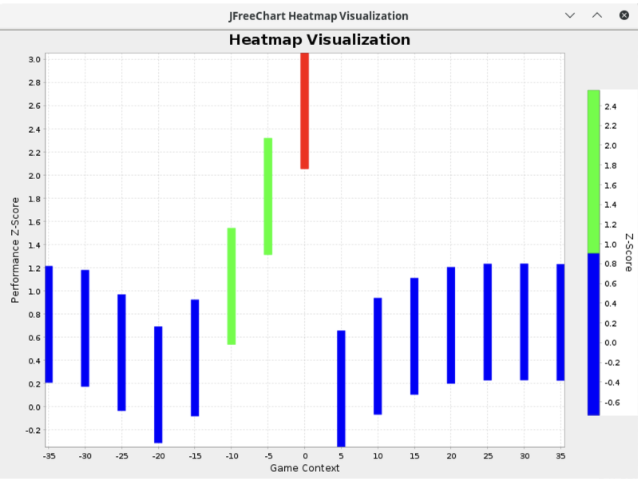
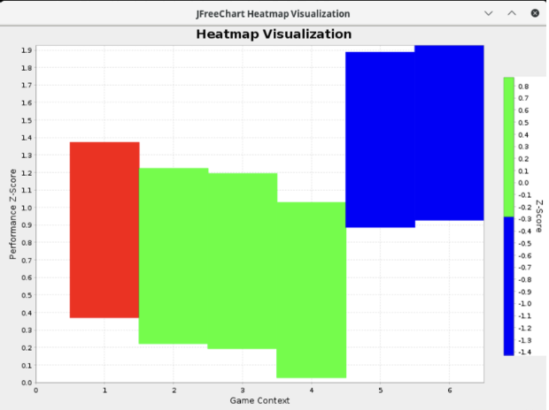
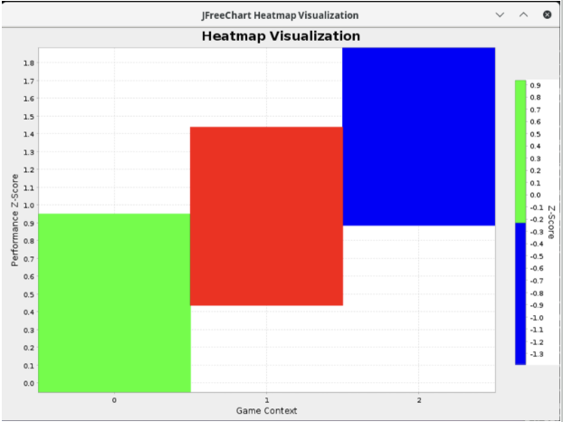

# NBA Player Performance Heatmap Analysis

## Project Overview
The NBA Player Performance Heatmap project provides an interactive, data-driven tool for analyzing and visualizing player performance across various game scenarios. By utilizing historical play-by-play data from the NBA, it offers insights into player strengths and weaknesses, categorized by game events such as scoring, turnovers, and performance under specific conditions.

### Key Features
- **Data-Driven Insights:** Analyzes performance across diverse game contexts.
- **Interactive Visualizations:** Generate heatmaps and view trends in near real-time.
- **Scalability:** Processes large datasets efficiently using Apache Spark.
- **Customizable Criteria:** Enables selection of players and criteria for tailored heatmaps.
- **User-Friendly GUI:** Developed in Java with a Tkinter interface for ease of use.

---

## Team Members
- **Nels Motley**: Heatmap data calculation, preprocessing, animations, and report contributions.
- **Thomas Stewart**: Heatmap visualization, GUI design, SQL-based player ID retrieval, and event mapping.
- **Kyle Benson**: Assisted with the final report.

---

## Dataset
- **Source:** Official NBA statistics via Kaggle.
- **Size:** ~2.56 GB, spanning the league's history from 1946 to the present.
- **Structure:** Includes player IDs, event descriptions, game periods, scores, and team metadata.

---

## Key Components

### 1. Preprocessing
- **Player ID Retrieval:** Uses a SQLite database to identify players based on name and team.
- **Data Cleaning:** Removes incomplete records and standardizes event descriptions.
- **Dataset Structuring:** Joins play-by-play data with game summaries to derive additional features (e.g., home/away status).

### 2. Event Classification
- **Categories:** 
  - *Good*: Actions like "shot," "assist," "dunk."
  - *Bad*: Actions like "turnover," "foul."
  - *Neutral*: Actions like "substitution," "timeout."
- **Techniques:** Regular expressions for keyword identification and classification.

### 3. Performance Scoring
- **Z-Score Normalization:** Standardizes player performance scores across event types and conditions.
- **Contextual Scoring:** Adjusted for factors like home/away games and score differentials.

### 4. Visualization
- **Heatmaps:** Generated using JFreeChart and displayed in the GUI.
- **Interactive GUI:** Allows selection of heatmap types and visualization criteria.
- **Customization:** View performance by score differential, period, or home/away contexts.

---

## Technical Details

### Tools and Frameworks
- **Apache Spark:** For distributed data processing.
- **SQLite:** Lightweight database for metadata.
- **Java:** For data processing and GUI development.
- **Tkinter & JFreeChart:** For GUI and heatmap visualization.
- **HDFS:** For data storage and retrieval.

### Architecture
1. **Preprocessing:** Clean and join datasets.
2. **Filtering:** Extract player-specific data.
3. **Classification:** Categorize plays as Good/Bad/Neutral.
4. **Scoring:** Normalize performance scores.
5. **Visualization:** Generate heatmaps.

---

## Implementation Highlights

### GUI Features
- User input fields for player name and team.
- Dropdown menus for heatmap type selection.
- Interactive heatmap rendering with sub-second latency.
- Configuration options for Spark cluster settings.

### Spark Jobs
- **Data Filtering:** Extracts rows based on player ID.
- **Event Classification:** Uses regex for play impact mapping.
- **Performance Scoring:** Aggregates and normalizes scores using Z-scores.

---

## Evaluation

### Metrics
- **Processing Efficiency:** Spark job execution averages ~1 minute for large datasets.
- **Visualization Latency:** Heatmaps render in ~56 milliseconds.
- **Usability:** High user satisfaction with the GUI and heatmap functionality.

### Testing
- Scalability: Tested with datasets ranging from single-season to multi-decade.
- Latency: Measured response times for interactive elements.
- Usability: Iterative user testing for GUI and heatmap refinement.

---

## How to Configure and Run the Project

### Setup
1. **Network Configuration:** 
   - Ensure Spark cluster accessibility.
   - Update the Spark master URL in `Config.java`.

2. **File Paths:**
   - Place `nba.sqlite` and `play_by_play.csv` in the paths specified in `Config.java`.
   - Configure HDFS output paths.

3. **Cluster Configuration:** Allocate sufficient resources (memory, cores) for Spark.

### Steps to Run
1. Clone the repository:
   ```bash
   git clone <repository-url>
   cd APACHE-SPARK-DISTRIBUTED-NBA-PLAYER-ANALYSIS
   ```
2. Compile the project:
   ```bash
   mvn clean package
   ```
3. Run the Spark job:
   ```bash
   spark-submit --class org.example.IDReduce \
       --master spark://<master-host>:<port> \
       target/spark-job.jar \
       /path/to/play_by_play.csv <playerId> /output/spark-job-results
   ```
4. Start the GUI:
   ```bash
   java -jar target/gui.jar /path/to/spark-job.jar /path/to/spark/home
   ```

---

## Project in Action

### Screenshots

1. **GUI Interface**
   *User input fields for player name and team with configuration options.*
   

2. **Generated Heatmaps**
   *Interactive heatmaps displaying performance trends.*
   - **Point Deficit:** 0 = tie.
     
   - **Quarter:** 5 and 6 indicate overtime.
     
   - **Home vs Away:** 0 = away, 1 = home, 2 = specialty games.
     

---

## Opportunities for Future Enhancements
- Advanced NLP for improved event classification.
- Real-time data integration for ongoing games.
- Multi-player heatmap comparisons.
- Expanded visualizations with additional charts and trends.

---

## Bibliography
1. Walsh, W. (2023). *NBA Database: Daily Updated SQLite Database*. Retrieved from [Kaggle](https://www.kaggle.com/datasets/wyattowalsh/basketball).
2. Martens, P. (2023). *NBA Shooting Heat Maps*. Retrieved from [GitHub](https://github.com/petermartens98/NBA-Shooting-Heatmaps).
3. National Basketball Association. (n.d.). *NBA Player Stats*. Retrieved from [NBA.com](https://www.nba.com/stats).

---

## Contact
For issues or questions, contact:
- **Thomas Stewart:** [Email](mailto:thomaslstewart1@gmail.com) | [Portfolio](https://thomasstewartpersonal.com)
- **Nels Motley:** [Email](mailto:Nels.motley@gmail.com)
- **Kyle Benson:** [Email](mailto:kyle.benson@colostate.edu)

--- 

This formatting ensures clarity, consistency, and professional presentation. Let me know if you need further adjustments!
