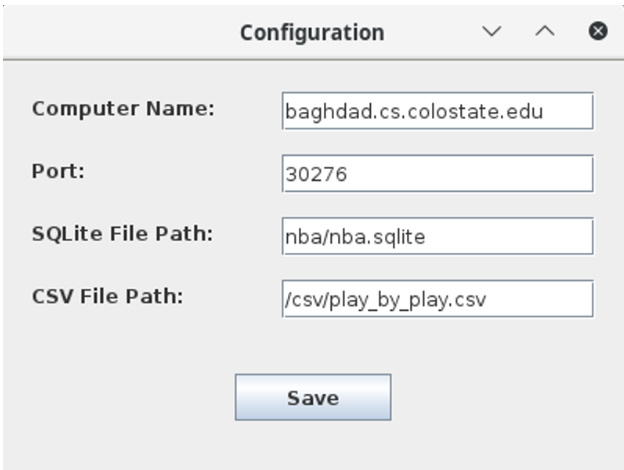

# NBA Player Performance Heatmap Analysis

## Project Overview
The NBA Player Performance Heatmap project aims to provide an interactive, data-driven tool for analyzing and visualizing player performance across various game scenarios. By utilizing historical play-by-play data from the NBA, this project delivers valuable insights into player strengths and weaknesses, categorized by game events such as scoring, turnovers, and performance under specific game conditions.

### Key Features
- **Data-Driven Insights:** Analyzes performance data for NBA players across various game contexts.
- **Interactive Visualizations:** Users can create heatmaps and view performance trends in near real-time.
- **Scalability:** Efficiently processes large datasets using Apache Spark.
- **Customizable Criteria:** Allows users to select players and criteria for generating heatmaps.
- **User-Friendly GUI:** Developed in Java with a Tkinter-based interface for seamless interaction.

---

## Team Members
- **Nels Motley**: Heatmap data calculation, preprocessing, animations, and report contributions.
- **Thomas Stewart**: Heatmap visualization, GUI design, SQL-based player ID retrieval, and event mapping.
- **Kyle Benson**: Assisted with the final report.

---

## Dataset
- **Source**: Official NBA statistics via Kaggle.
- **Size**: ~2.56 GB, spanning the league's history from 1946 to the present.
- **Structure**: Contains attributes such as player IDs, event descriptions, game periods, scores, and team metadata.

---

## Key Components

### 1. **Preprocessing**
- **Player ID Retrieval:** Utilizes a SQLite database to identify players based on name and team.
- **Data Cleaning:** Removes incomplete records and standardizes event descriptions.
- **Dataset Structuring:** Joins play-by-play data with game summary data to derive additional features like home/away status.

### 2. **Event Classification**
- Categorizes plays as:
  - **Good:** Actions like "shot," "assist," "dunk."
  - **Bad:** Actions like "turnover," "foul."
  - **Neutral:** Actions like "substitution," "timeout."
- **Regular Expressions:** Used to identify keywords and classify events efficiently.

### 3. **Performance Scoring**
- **Z-Score Normalization:** Standardizes player performance scores across different event types and game conditions.
- **Scoring Context:** Scores are adjusted based on factors like home/away games and score differentials.

### 4. **Visualization**
- **Heatmaps:** Generated using JFreeChart and displayed in the GUI.
- **Interactive GUI:** Built with Tkinter, enabling users to select heatmap types and criteria for visualization.
- **Customization:** Options for viewing performance by score differential, period, or home/away contexts.

---

## Technical Details

### Tools and Frameworks
- **Apache Spark**: Distributed processing for large-scale data analysis.
- **SQLite**: Lightweight database for player metadata.
- **Java**: Primary programming language for data processing and GUI.
- **Tkinter & JFreeChart**: Used for GUI and heatmap visualization.
- **HDFS**: Storage and retrieval of processed data.

### Architecture
- **Data Pipeline**:
  1. Preprocessing: Clean and join datasets.
  2. Filtering: Extract player-specific data.
  3. Classification: Categorize plays as Good/Bad/Neutral.
  4. Scoring: Normalize performance scores.
  5. Visualization: Generate heatmaps.

---

## Implementation Highlights

### GUI Features
- User input fields for player name and team.
- Dropdown menus for selecting heatmap types.
- Interactive heatmap rendering with sub-second latency.
- Configuration options for Spark cluster settings.

### Spark Jobs
- **Data Filtering:** Extracts relevant rows based on player ID.
- **Event Classification:** Applies regex-based mapping for play impacts.
- **Performance Scoring:** Aggregates and normalizes scores using Z-scores.

### Scalability
- Distributed computation ensures responsiveness even with large datasets.
- Local file operations optimize performance for lightweight tasks.

---

## Evaluation

### Metrics
- **Processing Efficiency:** Spark job execution averages ~1 minute for large datasets.
- **Visualization Latency:** Heatmaps render in an average of 56 milliseconds.
- **Usability:** User feedback indicates a high degree of intuitiveness and functionality.

### Testing
- **Scalability:** Tested with datasets ranging from single-season to multi-decade.
- **Latency:** Measured response times for interactive elements.
- **Usability:** Iterative testing with real users to refine GUI and heatmaps.

---

## How to Configure and Run the Project

### Network and File Setup
To properly run the project in a distributed environment, ensure the following configuration:

1. **Network Configuration:**
   - Ensure your Spark cluster is set up and accessible.
   - Update the Spark master URL in `Config.java` with the hostname or IP of your Spark master node (e.g., `spark://<master-host>:<port>`).
   
2. **File Paths:**
   - Place the SQLite database file (`nba.sqlite`) in the path specified in `Config.java`.
   - Update the path to the CSV dataset file (`play_by_play.csv`) in `Config.java`.
   - Ensure HDFS is properly configured, and set the HDFS output path in `Config.java`.

3. **Cluster Configuration:**
   - Configure the Spark cluster with sufficient resources (e.g., memory and cores).
   - Update Spark job submission scripts with the appropriate `--master` URL and resource allocation options.

### Steps to Run

1. **Clone the Repository:**
   ```bash
   git clone <repository-url>
   cd APACHE-SPARK-DISTRIBUTED-NBA-PLAYER-ANALYSIS
   ```

2. **Compile the Project:**
   ```bash
   mvn clean package
   ```

3. **Run the Spark Job:**
   ```bash
   spark-submit --class org.example.IDReduce \
       --master spark://<master-host>:<port> \
       target/spark-job.jar \
       /path/to/play_by_play.csv <playerId> /output/spark-job-results
   ```

4. **Start the GUI:**
   ```bash
   java -jar target/gui.jar /path/to/spark-job.jar /path/to/spark/home
   ```

5. **Interact with the Application:**
   - Use the GUI to input player and team details.
   - Select visualization criteria and view heatmaps interactively.

---

## Project in Action

### Screenshots

#### 1. GUI Interface
*User input fields for player name and team, alongside configuration options.*


#### 2. GUI Configuration
*User input feilds for Computer Name, Port, SQLite File Path, CSV File Path*



#### 3. Generated Heatmaps
*Interactive heatmaps displaying performance trends based on criteria.*

##### Point Deficit *0 is tied*

##### Quarter *5 and 6 are overtime**

##### Home vs Away *0 is away, 1 is home, and 2 is all star and other specialty games*


---

## Opportunities for Future Enhancements
- **Advanced NLP:** Replace keyword-based classification with natural language processing for improved accuracy.
- **Live Data Integration:** Enable real-time analysis of ongoing NBA games.
- **Player Comparisons:** Add functionality for multi-player heatmap overlays.
- **Expanded Visualizations:** Include additional charts and trend analyses.

---

## Bibliography
- Walsh, W. (2023). *NBA Database: Daily Updated SQLite Database*. Retrieved from [Kaggle](https://www.kaggle.com/datasets/wyattowalsh/basketball).
- Martens, P. (2023). *NBA Shooting Heat Maps*. Retrieved from [GitHub](https://github.com/petermartens98/NBA-Shooting-Heatmaps).
- National Basketball Association. (n.d.). *NBA Player Stats*. Retrieved from [NBA.com](https://www.nba.com/stats).

---

## Contact
For any issues or questions, please contact the contributors:
- **Thomas Stewart**: [Email](mailto:thomaslstewart1@gmail.com), [Portfolio](https://thomasstewartpersonal.com)
- **Nels Motley**: [Email](mailto:Nels.motley@gmail.com)
- **Kyle Benson**: [Email](mailto:kyle.benson@colostate.edu)

